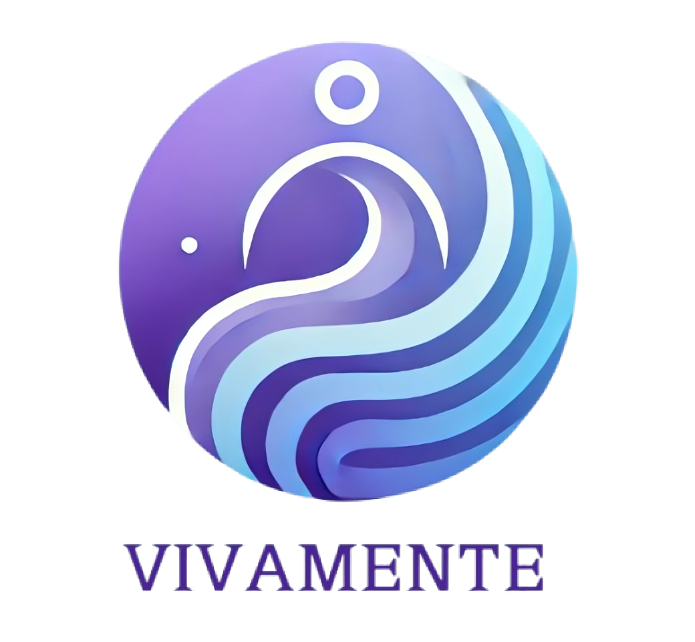

[![Contributors][contributors-shield]][contributors-url]
[![Forks][forks-shield]][forks-url]
[![Stargazers][stars-shield]][stars-url]
[![Issues][issues-shield]][issues-url]
[![LinkedIn][linkedin-shield]](https://www.linkedin.com/in/yassine-ben-zekri-72aa6b199/)

<!-- PROJECT LOGO -->
 

    <h1 style="font-size:35px">Vivamente  </h1>
     
    

        A comprehensive bipolar disorder management app designed to improve mental health and well-being.
     
     
    <a href="https://github.com/ahmedessouaied/TSYP12_VIVAMENTE/issues/new?labels=bug&template=bug-report---.md">Report Bug</a>
    ·
    <a href="https://github.com/ahmedessouaied/TSYP12_VIVAMENTE/issues/new?labels=enhancement&template=feature-request---.md">Request Feature</a>
  

    
  

  GNN Inference and Fusion Process

GNN Inference and Fusion Process
================================

This script demonstrates a full pipeline for leveraging a Graph Neural Network (GNN) to predict bipolar disorder phases and symptoms (YMRS, PHQ-9), and then fuse those predictions with external wearable device data. It highlights several key processes, including data preparation, graph construction, model inference, and prediction fusion.

    

        
    

* * *

Key Components
--------------

### 1\. Model Definition

The model, `CombinedSymptomMetricGNN`, is defined as a GNN using `GATConv` layers. Its features include:

*   Two GATConv layers for graph-based feature extraction.
*   Separate linear layers to predict YMRS and PHQ-9 scores.
*   A final output layer to classify bipolar phases (e.g., Mania, Depression, Euthymia).
*   Softmax activation for class probabilities and a custom metric for Combined Symptom Metric (CSM).

        class CombinedSymptomMetricGNN(torch.nn.Module):
            def forward(self, x, edge\_index, batch):
                ...
                return logits, ymrs\_scores, phq9\_scores, csm
    

### 2\. Data Preparation

Data preparation is handled by the `DataMerger` and `GraphConstructor` classes:

*   **DataMerger**: Merges multimodal data (e.g., video, audio, and text) into a unified dataset.
*   **GraphConstructor**: Transforms the merged dataset into a graph structure suitable for PyTorch Geometric.

Here’s an example of adding dummy nodes to the graph:

        graph\_constructor.add\_timestamp\_nodes(timestamp=0, video\_data={}, audio\_data={},
                                              question\_text="?", answer\_text="!")
    

### 3\. Fusion Logic

The `fuse_predictions` function combines predictions from the GNN with those from a wearable device service. Fusion logic includes:

*   Extracting probabilities, classes, and symptom scores from the GNN.
*   Fetching predictions from the wearable device API.
*   Applying rule-based logic to resolve disagreements (e.g., using CSM values or averaging probabilities).

Example fallback mechanism for wearable prediction failures:

        if wearable prediction fails:
            return {
                "final\_class": gnn\_class,
                "fusion\_reasoning": "Fell back to GNN prediction due to wearable prediction failure."
            }
    

### 4\. Main Execution

The main script orchestrates the entire pipeline, including:

*   Merging data with `DataMerger`.
*   Constructing a graph with `GraphConstructor`.
*   Loading the trained GNN model and performing inference.
*   Applying the fusion logic to produce final predictions.

Here’s an example of model inference:

        with torch.no\_grad():
            logits, ymrs\_scores, phq9\_scores, csm = model(data.x, data.edge\_index, batch)
    

* * *

Fusion Results
--------------

Once the predictions from both sources (GNN and wearable device) are fused, the final results include:

*   **Final Class**: Predicted bipolar phase (Mania, Depression, Euthymia).
*   **Fused Probabilities**: Averaged probabilities across GNN and wearable device.
*   **Individual Scores**: YMRS and PHQ-9 predictions from both sources.
*   **Reasoning**: Explanation of how the fusion was determined.

Example final result object:

        {
            "final\_class": 0,
            "fused\_probabilities": \[0.6, 0.3, 0.1\],
            "gnn\_probs": \[0.7, 0.2, 0.1\],
            "wearable\_probs": \[0.5, 0.4, 0.1\],
            "gnn\_ymrs": 12.0,
            "wearable\_ymrs": 11.5,
            "gnn\_csm": 6.0,
            "fusion\_reasoning": "Both GNN and wearable device agree on the same class."
        }
    

* * *

Usage
-----

1.  Prepare data and run the `DataMerger` to produce a unified dataset.
2.  Construct the graph using `GraphConstructor`.
3.  Load the trained GNN model and perform inference.
4.  Fuse predictions using the `fuse_predictions` function.
5.  Review the final predictions and reasoning.

Run the script as:

        pip install requirements.txt
        python main.py
    

* * *

<!-- MARKDOWN LINKS & IMAGES -->
[contributors-shield]: https://img.shields.io/github/contributors/ahmedessouaied/TSYP12_VIVAMENTE.svg?style=for-the-badge
[contributors-url]: https://github.com/ahmedessouaied/TSYP12_VIVAMENTE/graphs/contributors
[forks-shield]: https://img.shields.io/github/forks/ahmedessouaied/TSYP12_VIVAMENTE.svg?style=for-the-badge
[forks-url]: https://github.com/ahmedessouaied/TSYP12_VIVAMENTE/network/members
[stars-shield]: https://img.shields.io/github/stars/ahmedessouaied/TSYP12_VIVAMENTE.svg?style=for-the-badge
[stars-url]: https://github.com/ahmedessouaied/TSYP12_VIVAMENTE/stargazers
[issues-shield]: https://img.shields.io/github/issues/ahmedessouaied/TSYP12_VIVAMENTE.svg?style=for-the-badge
[issues-url]: https://github.com/ahmedessouaied/TSYP12_VIVAMENTE/issues
[license-shield]: https://img.shields.io/github/license/ahmedessouaied/TSYP12_VIVAMENTE.svg?style=for-the-badge
[license-url]: https://github.com/ahmedessouaied/TSYP12_VIVAMENTE/blob/master/LICENSE
[linkedin-shield]: https://img.shields.io/badge/-LinkedIn-black.svg?style=for-the-badge&logo=linkedin&colorB=555
[linkedin-url]: https://www.linkedin.com/in/yassine-ben-zekri-72aa6b199/
