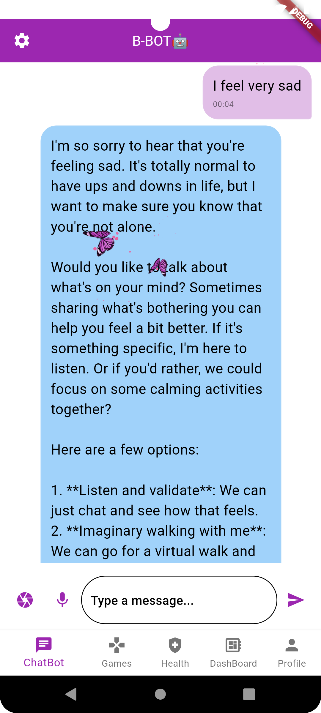
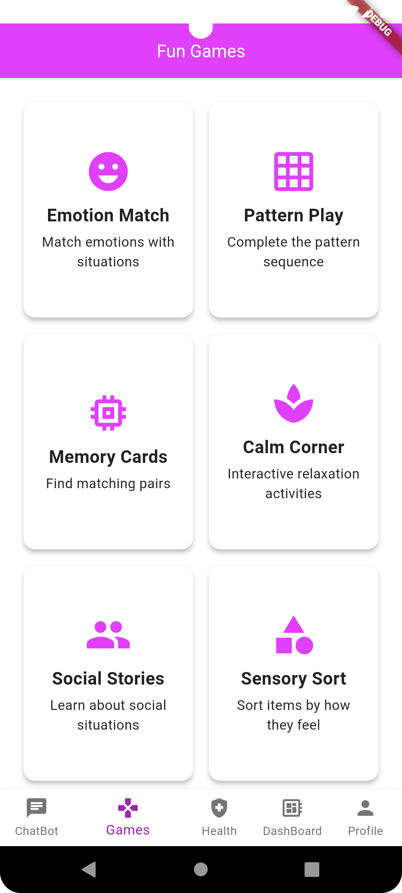
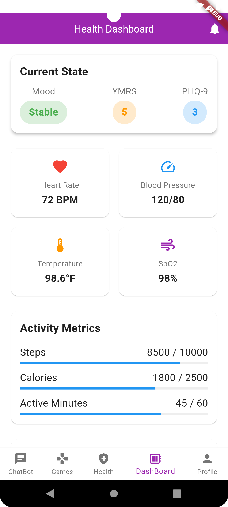
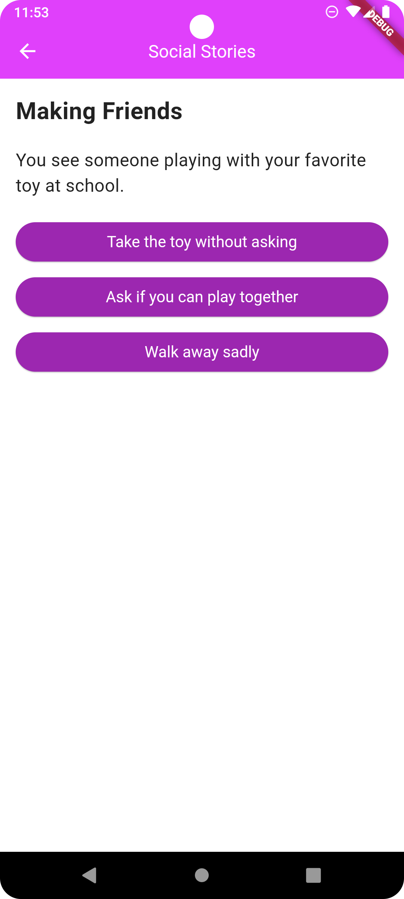
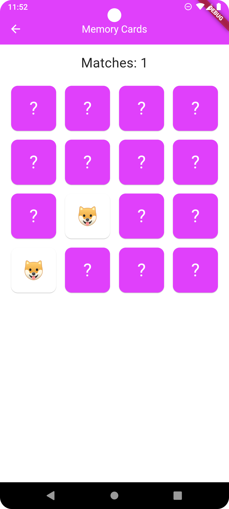
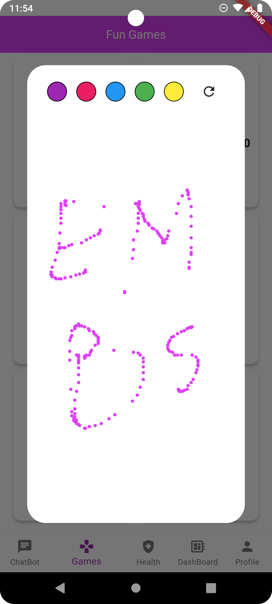
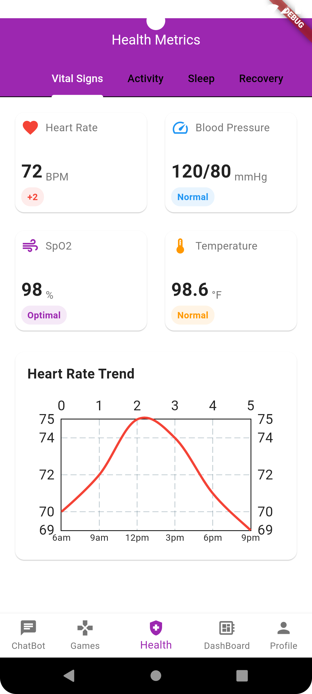
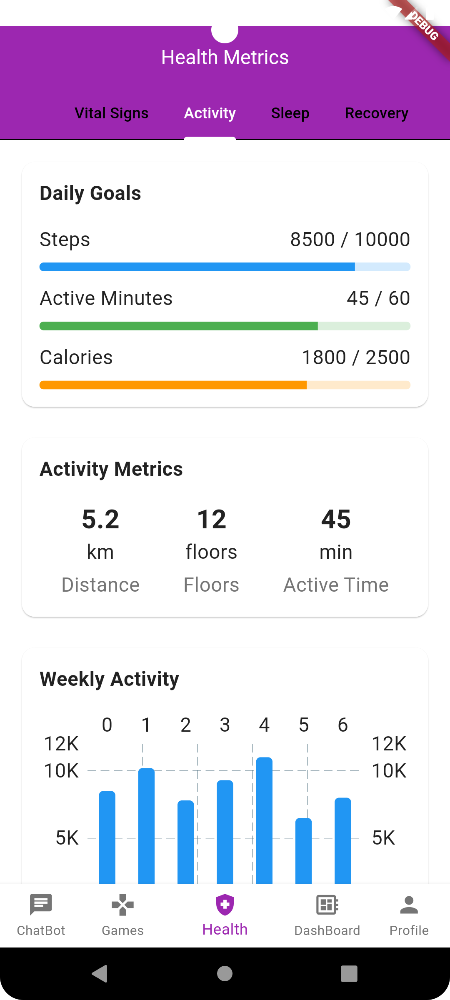
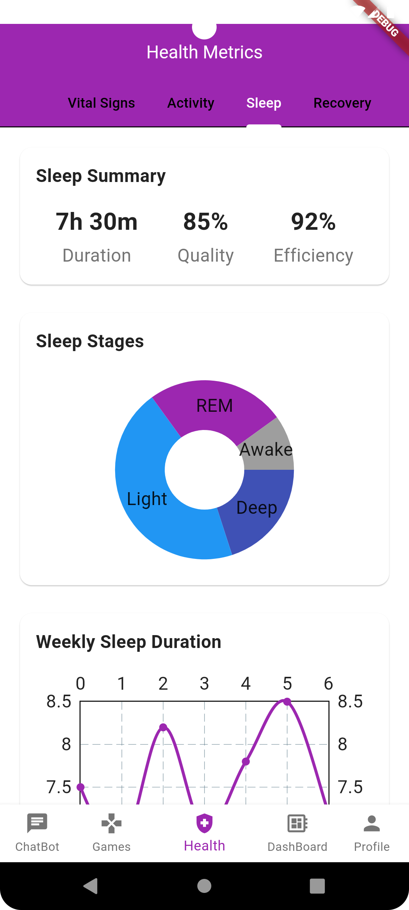

<a name="readme-top"></a>
<div align="center">

[![Contributors][contributors-shield]][contributors-url]
[![Forks][forks-shield]][forks-url]
[![Stargazers][stars-shield]][stars-url]
[![Issues][issues-shield]][issues-url]
[![LinkedIn][linkedin-shield]](https://www.linkedin.com/in/chater-marzougui-342125299/)
</div>

<!-- PROJECT LOGO -->
<br />
<div align="center">
    <h1 style="font-size:35px">Vivamente <br></h1>
    <br>
    <p style="font-size:20px" align="center">
        A comprehensive bipolar disorder management app designed to improve mental health and well-being.
    <br>
    <br>
    <a href="https://github.com/ahmedessouaied/TSYP12_VIVAMENTE/issues/new?labels=bug&template=bug-report---.md">Report Bug</a>
    ·
    <a href="https://github.com/ahmedessouaied/TSYP12_VIVAMENTE/issues/new?labels=enhancement&template=feature-request---.md">Request Feature</a>
  </p>
  <br><br>
  <a href="https://github.com/ahmedessouaied/TSYP12_VIVAMENTE">
    
  </a>
</div>

# Vivamente

<!-- TABLE OF CONTENTS -->
<details>
  <summary>Table of Contents</summary>
  <ol>
    <li><a href="#about-the-project">About The Project</a></li>
    <li><a href="#features">Features</a></li>
    <li><a href="#installation">Installation</a></li>
    <li><a href="#contributing">Contributing</a></li>
    <li><a href="#license">License</a></li>
    <li><a href="#contact">Contact</a></li>
  </ol>
</details>

<!-- ABOUT THE PROJECT -->
## About The Project

Vivamente is an innovative app focused on empowering individuals with bipolar disorder. The app offers a suite of features to help users track their sleep, moods, habits, and overall health metrics. By leveraging advanced analytics and a user-friendly interface, Vivamente aims to improve mental health management and enhance well-being.

<div style="display:flex;flex-direction:column;justify-content:canter;" align="center">
    <div>
        
        
        
    </div>
    <br/>
    <div>
        
        
        
    </div>
    <br/>
    <div>
        
        
        
    </div>
</div>

## Features

- **Sleep Logs:** Track sleep duration, quality, and consistency.
- **Health Overview:** Visualize mood states, activity levels, and medication adherence.
- **Phase Forecasting:** Predict future mood states with risk alerts.
- **Habit Recommendations:** Receive personalized tips and monitor progress.
- **Notifications:** Stay on track with reminders for sleep, mood check-ins, and habits.
- **Chatbot Support:** Instant mental health advice and resources.
- **Relaxing Games:** Interactive activities to reduce stress.

<p align="right">(<a href="#readme-top">back to top</a>)</p>

## Installation

1. **Clone the repository**:
   ```bash
   git clone https://github.com/ahmedessouaied/TSYP12_VIVAMENTE.git
   ```
2. **Navigate to the project directory**:
   ```bash
   cd vivamente
   ```
3. **Install dependencies**:
   ```bash
   flutter pub get
   ```
4. **Run the application**:
   ```bash
   flutter run
   ```
5. **Launch the app** in your browser or emulator.

<p align="right">(<a href="#readme-top">back to top</a>)</p>

## Apk

   ```bash
   You can download the apk directly it is in the repo and in the chatbot setting put the backend url
```

<p align="right">(<a href="#readme-top">back to top</a>)</p>

<!-- MARKDOWN LINKS & IMAGES -->
[contributors-shield]: https://img.shields.io/github/contributors/ahmedessouaied/TSYP12_VIVAMENTE.svg?style=for-the-badge
[contributors-url]: https://github.com/ahmedessouaied/TSYP12_VIVAMENTE/graphs/contributors
[forks-shield]: https://img.shields.io/github/forks/ahmedessouaied/TSYP12_VIVAMENTE.svg?style=for-the-badge
[forks-url]: https://github.com/ahmedessouaied/TSYP12_VIVAMENTE/network/members
[stars-shield]: https://img.shields.io/github/stars/ahmedessouaied/TSYP12_VIVAMENTE.svg?style=for-the-badge
[stars-url]: https://github.com/ahmedessouaied/TSYP12_VIVAMENTE/stargazers
[issues-shield]: https://img.shields.io/github/issues/ahmedessouaied/TSYP12_VIVAMENTE.svg?style=for-the-badge
[issues-url]: https://github.com/ahmedessouaied/TSYP12_VIVAMENTE/issues
[license-shield]: https://img.shields.io/github/license/ahmedessouaied/TSYP12_VIVAMENTE.svg?style=for-the-badge
[license-url]: https://github.com/ahmedessouaied/TSYP12_VIVAMENTE/blob/master/LICENSE
[linkedin-shield]: https://img.shields.io/badge/-LinkedIn-black.svg?style=for-the-badge&logo=linkedin&colorB=555
[linkedin-url]: https://www.linkedin.com/in/chater-marzougui-342125299/
