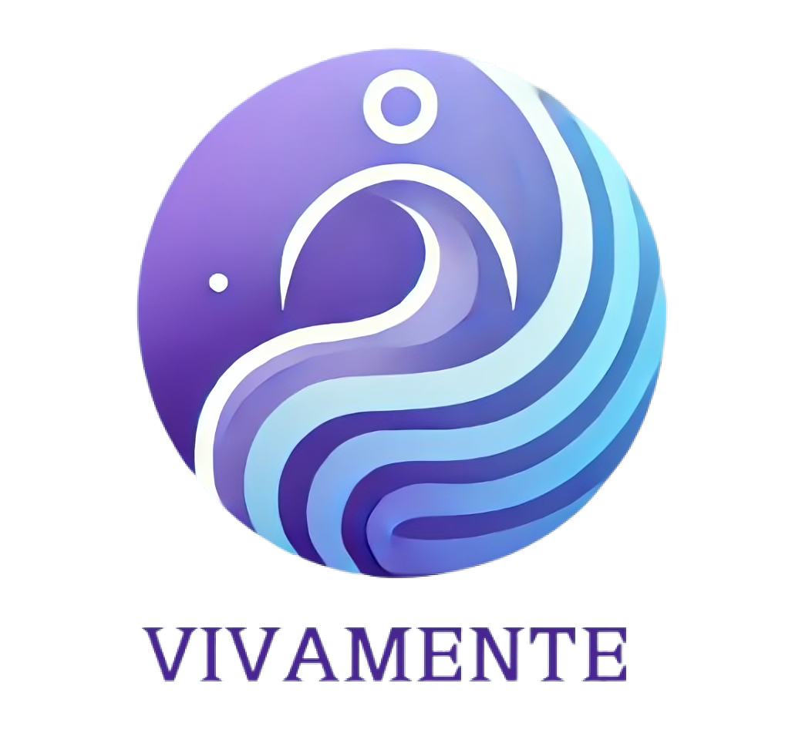
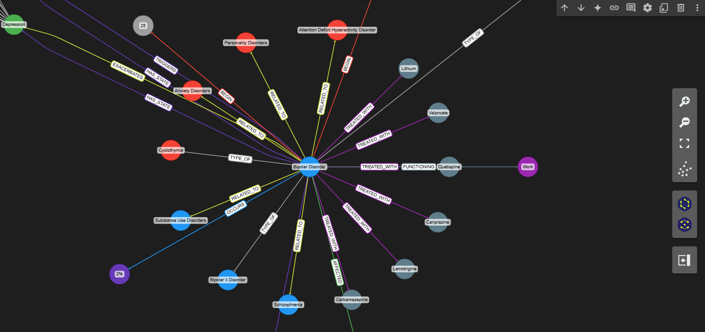
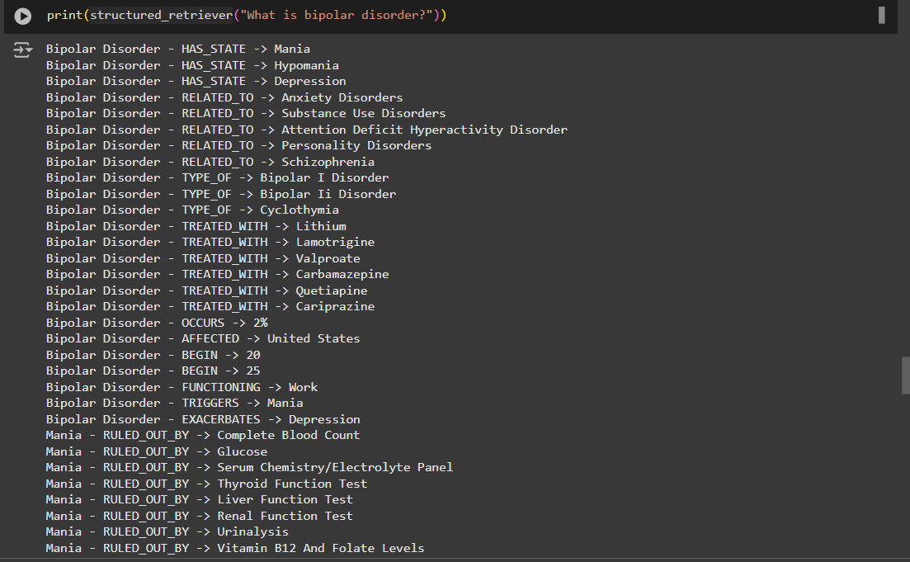
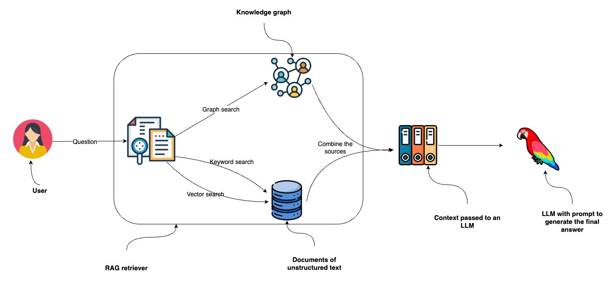

[![Contributors][contributors-shield]][contributors-url]
[![Forks][forks-shield]][forks-url]
[![Stargazers][stars-shield]][stars-url]
[![Issues][issues-shield]][issues-url]
[![LinkedIn][linkedin-shield]](https://www.linkedin.com/in/ahmed-essouaied)

<!-- PROJECT LOGO -->
 

    <h1 style="font-size:35px">Vivamente  </h1>
     
    

        A comprehensive bipolar disorder management app designed to improve mental health and well-being.
     
     
    <a href="https://github.com/ahmedessouaied/TSYP12_VIVAMENTE/issues/new?labels=bug&template=bug-report---.md">Report Bug</a>
    ·
    <a href="https://github.com/ahmedessouaied/TSYP12_VIVAMENTE/issues/new?labels=enhancement&template=feature-request---.md">Request Feature</a>
  

    
  

# LLM for Bipolar Disorder Detection

## Overview
This project integrates advanced LLM capabilities with graph-based retrieval methods to enhance reasoning and diagnostic capabilities. By leveraging:

- Fine-tuning the LLM with Unsloth on datasets from Hugging Face.
- A *Graph-RAG* approach using Neo4j and Wikipedia for bipolar disorder-related data.
- Additional RAG leveraging PDF files and books for generating psychiatry-like diagnostic questions.
- Methodologies from the *Think-on-Graph 2.0* paper for reasoning and retrieval.

      

        
      

      

        
      

      

        
      

---

## Process Flow
1. *Check if the user has bipolar disorder:*
   - Analyze multimodal data and generate questions using the Chain-of-Thought logic.

2. *If diagnosed:*
   - Detect the specific phase: *Remission, Mania, or Depression*.

---

## Reasoning Methodology
The system utilizes a chain of thought based on the *Think-on-Graph 2.0*, combining:

- Graph-based and text-based retrieval tightly coupled for in-depth exploration.
- Iterative reasoning with collaborative entity discovery and document retrieval.
- Fine-tuned LLMs to enhance the diagnosis and phase detection.

---

## Technical Stack

- *LLM Fine-tuning:* Hugging Face datasets with Unsloth.
- *Graph Database:* Neo4j with Wikipedia data loader.
- *Additional Knowledge:* PDF books on psychiatry for contextual question generation.
- *Framework:* Based on principles from Think-on-Graph 2.0.
- *Context and Prompt Engineering:* Predictions from the GNN updated daily to dynamically guide the LLM.

---

## Retrieval-Augmented Generation (RAG) and Graph-RAG

*RAG* allows the LLM to enhance its reasoning by retrieving external knowledge dynamically. This system uses:

- Standard RAG for incorporating textual information from structured and unstructured data sources.
- *Graph-RAG*, which extends RAG by tightly coupling textual retrieval with graph-based relationships. Neo4j facilitates deeper and more context-aware retrieval, leveraging Wikipedia and other knowledge sources to bridge connections between entities and facts.

Graph-RAG strengthens the LLM's diagnostic accuracy by iteratively refining entity relationships and augmenting the retrieval process with graph-based logic.

---

## How to Use the Model

Our fine-tuned model is available on Hugging Face: *[Hamatoysin/EMBS-G](https://huggingface.co/Hamatoysin/EMBS-G)*.

You can run the model effortlessly using *Ollama*. Follow these steps:

1. Install Ollama:
   
brew install ollama

2. Run the model:
   
ollama run hf.co/Hamatoysin/EMBS-G

This command connects directly to our model hosted on Hugging Face and enables seamless execution.

[contributors-shield]: https://img.shields.io/github/contributors/ahmedessouaied/TSYP12_VIVAMENTE.svg?style=for-the-badge
[contributors-url]: https://github.com/ahmedessouaied/TSYP12_VIVAMENTE/graphs/contributors
[forks-shield]: https://img.shields.io/github/forks/ahmedessouaied/TSYP12_VIVAMENTE.svg?style=for-the-badge
[forks-url]: https://github.com/ahmedessouaied/TSYP12_VIVAMENTE/network/members
[stars-shield]: https://img.shields.io/github/stars/ahmedessouaied/TSYP12_VIVAMENTE.svg?style=for-the-badge
[stars-url]: https://github.com/ahmedessouaied/TSYP12_VIVAMENTE/stargazers
[issues-shield]: https://img.shields.io/github/issues/ahmedessouaied/TSYP12_VIVAMENTE.svg?style=for-the-badge
[issues-url]: https://github.com/ahmedessouaied/TSYP12_VIVAMENTE/issues
[license-shield]: https://img.shields.io/github/license/ahmedessouaied/TSYP12_VIVAMENTE.svg?style=for-the-badge
[license-url]: https://github.com/ahmedessouaied/TSYP12_VIVAMENTE/blob/master/LICENSE
[linkedin-shield]: https://img.shields.io/badge/-LinkedIn-black.svg?style=for-the-badge&logo=linkedin&colorB=555
[linkedin-url]: https://www.linkedin.com/in/ahmed-essouaied/
