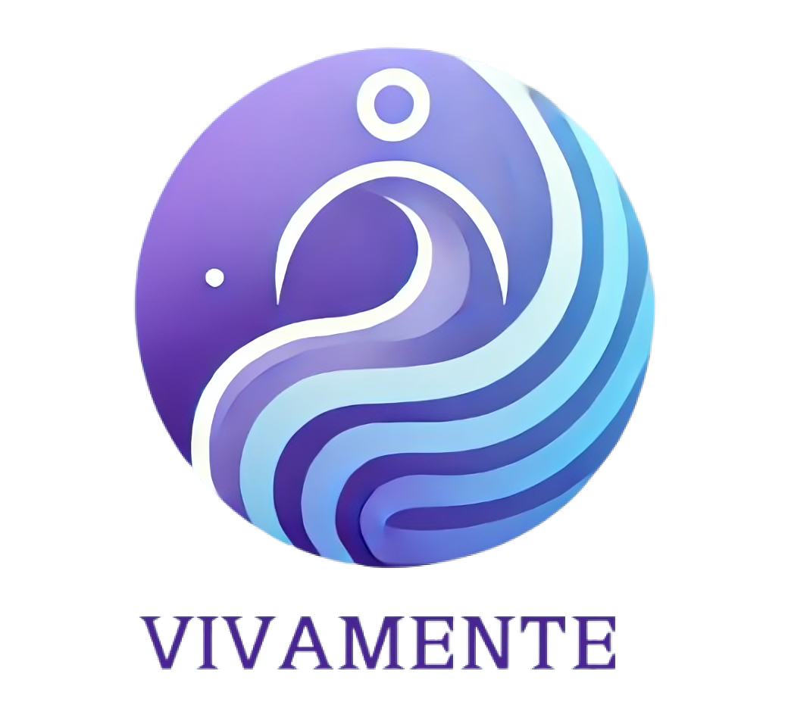

<div align="center">

[![Contributors][contributors-shield]][contributors-url]
[![Forks][forks-shield]][forks-url]
[![Stargazers][stars-shield]][stars-url]
[![Issues][issues-shield]][issues-url]
[![LinkedIn][linkedin-shield]](https://www.linkedin.com/in/yassine-ben-zekri-72aa6b199/)
[![LinkedIn][linkedin-shield]](https://www.linkedin.com/in/ahmed-essouaied)
[![LinkedIn][linkedin-shield]](https://www.linkedin.com/in/chater-marzougui-342125299/)
[![LinkedIn][linkedin-shield]](https://www.linkedin.com/in/aziz-khadraoui/)
</div>

<!-- PROJECT LOGO -->
<br />
<div align="center">
    <h1 style="font-size:35px">Vivamente <br></h1>
    <br>
    <p style="font-size:20px" align="center">
        A comprehensive bipolar disorder management app designed to improve mental health and well-being.
    <br>
    <br>
    <a href="https://github.com/ahmedessouaied/TSYP12_VIVAMENTE/issues/new?labels=bug&template=bug-report---.md">Report Bug</a>
    ·
    <a href="https://github.com/ahmedessouaied/TSYP12_VIVAMENTE/issues/new?labels=enhancement&template=feature-request---.md">Request Feature</a>
  </p>
  <br><br>
  <a href="https://github.com/ahmedessouaied/TSYP12_VIVAMENTE">
    
  </a>
</div>


# Vivamente: A Multimodal Mobile Application

## Overview
Vivamente is a cutting-edge multimodal mobile application designed to enhance mental health diagnostics and support through advanced AI-driven technologies. The app leverages:

- **Chain-of-Thought reasoning** integrated with a fine-tuned **LLaMA 3.2** model and **Graph-RAG** for dynamic and in-depth knowledge retrieval.
- **Graph Neural Network (GNN):** Processes multimodal features from video, audio, and transcripts to deliver accurate diagnostic outputs.
- **Wearable Device Integration:** Captures physiological features, processed through an ensemble model for enhanced diagnostic precision.


---

## Functionality
### Interaction with the User
The mobile app interacts with users through:
- **LLM Conversations:** Engaging users with psychiatry-style questions using a fine-tuned LLaMA 3.2.
- **Dynamic Prompting:** Adjusting questions and advice based on diagnostic outputs.

### Multimodal Inputs and Processing
1. **Video and Audio Data:**
   - Uploaded to **Azure Blob Storage** for processing.
   - **Feature Extraction:**
     - **Audio:** Processed using OpenSMILE for acoustic features.
     - **Video:** Processed using OpenFace for facial feature extraction.
   - **Transcription:** Audio data is transcribed using **Whisper**.
   - All extracted features are fed into a **Graph Neural Network (GNN)**.

2. **Wearable Device Integration:**
   - Extracts physiological features such as heart rate variability and skin conductivity.
   - Features are exported to Azure for processing using an **ensemble model** comprising:
     - **XGBoost**
     - **CatBoost**
     - **LightGBM**

### Diagnostic Output
Both the **GNN** and **Wearable Model** produce classifications:
- **0:** Depression
- **1:** Remission
- **2:** Mania

### Fusion and Final Output
- A **Rule-Based Fusion Function** combines outputs from the GNN and wearable model.
- The final diagnostic output dynamically adjusts the LLM’s prompt to:
  - Improve diagnostic accuracy.
  - Offer phase-specific advice and support to the user.

---

## Technical Architecture
### Core Components
1. **LLM Fine-tuning:** Hugging Face datasets with specialized domain knowledge.
2. **Azure Infrastructure:**
   - **Blob Storage** for data uploads and processing.
   - Compute resources for feature extraction and model inference.
3. **Multimodal Models:**
   - **GNN:** Integrates audio, video, and transcript features.
   - **Wearable Model:** Ensemble learning approach for physiological data.

### Retrieval-Augmented Generation (RAG) and Graph-RAG
- **RAG:** Enhances LLM reasoning by retrieving relevant external knowledge.
- **Graph-RAG:** Combines text-based and graph-based retrieval for deeper context and entity relationships.
  - Uses Neo4j with Wikipedia and custom datasets for entity linking and knowledge graph construction.

---

## How to Use Vivamente
### Access the Model
Our fine-tuned model is available on Hugging Face: **[Hamatoysin/EMBS-G](https://huggingface.co/Hamatoysin/EMBS-G)**.

### Run the Model
You can run the model effortlessly using **Ollama**. Follow these steps:

1. Install Ollama:
   ```bash
   brew install ollama
   ```

2. Run the model:
   ```bash
   ollama run hf.co/Hamatoysin/EMBS-G
   ```

This command connects directly to our model hosted on Hugging Face and enables seamless execution.

---

## Future Enhancements
- **Enhanced Wearable Integration:** Real-time streaming and analysis of physiological data.
- **Expanded RAG Sources:** Incorporating additional datasets for broader diagnostic capabilities.
- **User Feedback Loop:** Continuous improvement of the LLM through user interaction data.


<!-- MARKDOWN LINKS & IMAGES -->
[contributors-shield]: https://img.shields.io/github/contributors/ahmedessouaied/TSYP12_VIVAMENTE.svg?style=for-the-badge
[contributors-url]: https://github.com/ahmedessouaied/TSYP12_VIVAMENTE/graphs/contributors
[forks-shield]: https://img.shields.io/github/forks/ahmedessouaied/TSYP12_VIVAMENTE.svg?style=for-the-badge
[forks-url]: https://github.com/ahmedessouaied/TSYP12_VIVAMENTE/network/members
[stars-shield]: https://img.shields.io/github/stars/ahmedessouaied/TSYP12_VIVAMENTE.svg?style=for-the-badge
[stars-url]: https://github.com/ahmedessouaied/TSYP12_VIVAMENTE/stargazers
[issues-shield]: https://img.shields.io/github/issues/ahmedessouaied/TSYP12_VIVAMENTE.svg?style=for-the-badge
[issues-url]: https://github.com/ahmedessouaied/TSYP12_VIVAMENTE/issues
[license-shield]: https://img.shields.io/github/license/ahmedessouaied/TSYP12_VIVAMENTE.svg?style=for-the-badge
[license-url]: https://github.com/ahmedessouaied/TSYP12_VIVAMENTE/blob/master/LICENSE
[linkedin-shield]: https://img.shields.io/badge/-LinkedIn-black.svg?style=for-the-badge&logo=linkedin&colorB=555
[linkedin-url]: https://www.linkedin.com/in/chater-marzougui-342125299/